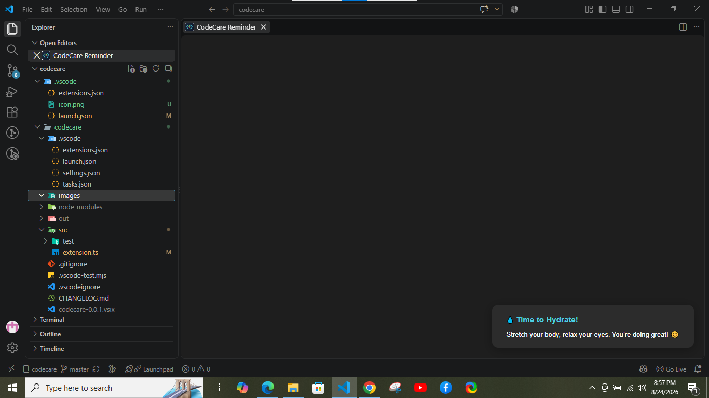
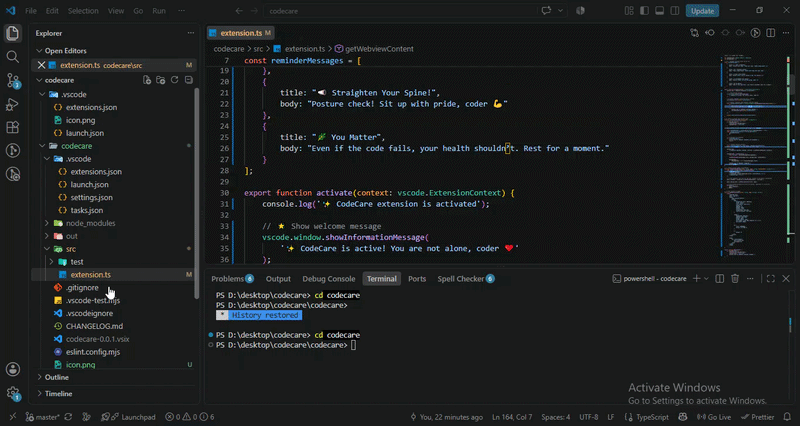
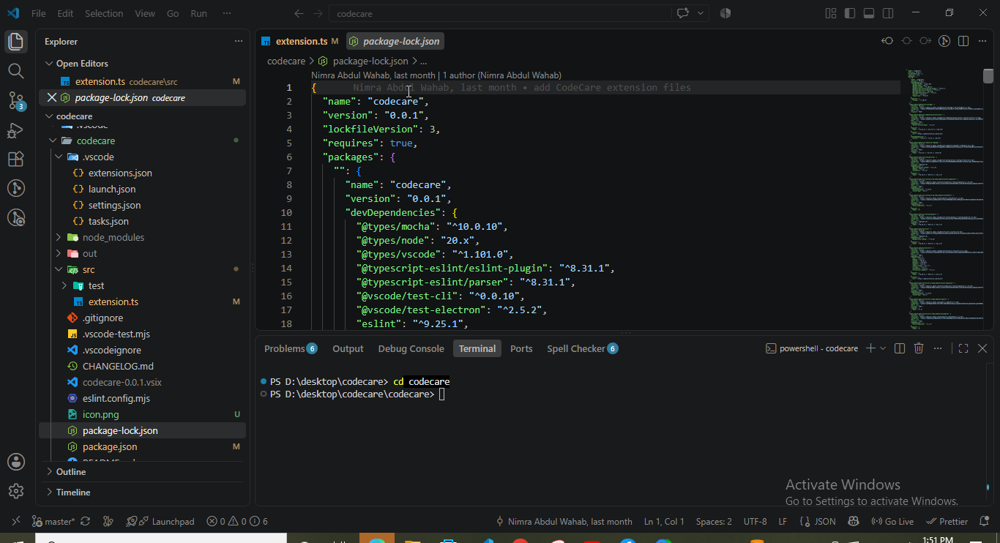

# CodeCare 🌿

Gently reminds developers to hydrate, stretch, and relax while coding.



## What it does

CodeCare is a lightweight VS Code extension that pops up gentle, friendly reminders while you code — so you don't forget to take care of yourself while taking care of your code.

- 💧 Hydrate yourself
- 🧘 Stretch a bit
- 🪑 Fix your posture
- ❤️ Take breaks and care for your well-being while coding

## Features

- **Starts automatically** — no setup needed. Install it, and it starts working as soon as VS Code finishes loading.
- **Gentle rotating reminders** — a small set of friendly messages shown one after another, so it never feels repetitive.
- **Fully configurable interval** — decide exactly how often you want to be reminded (see below).
- **Enable/disable anytime** — turn reminders off with a single setting if you need uninterrupted focus time.

## ⚙️ How to change the reminder interval

By default, CodeCare reminds you every **30 minutes**. You can change this to whatever works for you — for example, every 20 or 60 minutes.

1. Open VS Code **Settings**:
   - Press `Ctrl + ,` (Windows/Linux) or `Cmd + ,` (Mac), **or**
   - Click the ⚙️ gear icon in the bottom-left corner → **Settings**
2. In the search box, type:
   ```
   codecare
   ```
3. You'll see two settings:
   - **Codecare: Enable Reminders** — turn reminders on or off
   - **Codecare: Reminder Interval** — set how often (in minutes) you want to be reminded
4. Type your preferred number (e.g. `20`, `30`, `60`) into the Reminder Interval box.
5. That's it — no restart needed, it applies immediately.

> 💡 Tip: The 20-20-20 rule (a 20-second break every 20 minutes) is a well-known guideline for eye health — feel free to use that as a starting point.

## Demo





## Feedback & Contributions

Found a bug or have an idea? Feel free to open an issue on [GitHub](https://github.com/NIM-hub/codecare/issues).

## License

MIT © DevSilva